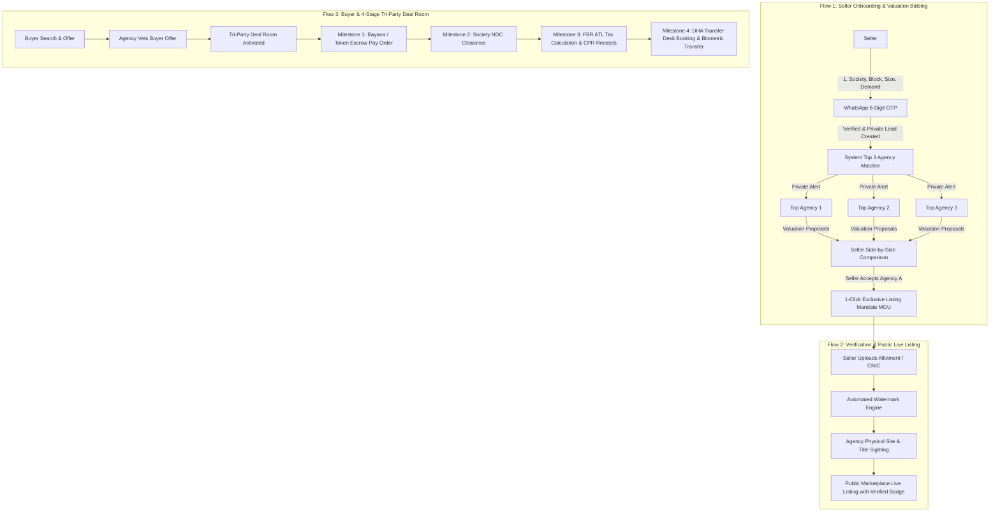

# NexMove: Private Seller Lead, Agency Valuation Bidding, FBR Tax Engine, Deal Room & AI Chatbot Architecture

Is implementation plan mein Pakistani real estate market ki ground realities ke mutabiq complete end-to-end workflow document kiya gaya hai: Private Seller Lead Submission, WhatsApp OTP Verification, Top 3 Agency Smart Matching & Bidding, Automated Document Watermarking, Real-Time FBR Tax Engine, 4-Stage Digital Deal Room, Overseas Pakistani Closing Suite, aur NexMove AI Real Estate Assistant (Gemini-Powered Chatbot).

---

## User Review Required

> [!IMPORTANT]
> **No Execution Without Prior Approval:** Yeh plan sirf design aur architecture ki documentation ke liye banaya gaya hai. Jab tak aap mutafiq ho kar *"Proceed"* ka button ya prompt nahi dein ge, tab tak koi bhi code change ya execution nahi ki jayegi.

> [!NOTE]
> **Progressive Onboarding Philosophy:** Aam visitors aur buyers bina login ke browsing/filters use kar sakte hain. Seller ke liye passwordless WhatsApp OTP onboarding hogi, jabke Agencies aur Deal Room participants ke liye verified authentication lazmi hogi.

---

## Architecture Overview & User Flows

---

## Proposed Technical Changes

### 1. Database Schema & Prisma Models (`prisma/schema.prisma`)

Naye enums aur models database mein add kiye jayenge:

#### [MODIFY] [prisma/schema.prisma](file:///c:/Users/NexMove%20Development/Desktop/NexMove/prisma/schema.prisma)

- **Enums Additions:**
  - `PrivateLeadStatus`: `SUBMITTED`, `MATCHED`, `VALUATIONS_RECEIVED`, `AGENCY_ASSIGNED`, `LISTED`, `EXPIRED`.
  - `ValuationProposalStatus`: `SUBMITTED`, `ACCEPTED`, `DECLINED`, `EXPIRED`.
  - `DealMilestoneStatus`: `PENDING`, `IN_PROGRESS`, `DOCUMENT_UPLOADED`, `VERIFIED`, `COMPLETED`.
  - `TaxPayerStatus`: `ACTIVE_FILER`, `LATE_FILER`, `NON_FILER`, `EXEMPT`.
  - `PoaStatus`: `NOT_APPLICABLE`, `EMBASSY_SUBMITTED`, `MOFA_ATTESTED`, `SOCIETY_REGISTERED`, `VERIFIED`.

- **New Models:**
  1. `PrivateSellerLead`:
     - Fields: `id`, `society`, `phase`, `block`, `propertyType`, `plotNumber` (encrypted/hidden), `areaSqFt`, `demandPKR`, `features`, `sellerName`, `sellerWhatsApp`, `whatsappOtpVerified`, `status`, `assignedAgencyId`, timestamps.
  2. `AgencyValuationProposal`:
     - Fields: `id`, `leadId`, `agencyId`, `estimatedMinPKR`, `estimatedMaxPKR`, `sellingDaysEstimate`, `marketingStrategy`, `commissionRate`, `status`, `notes`, timestamps.
  3. `ExclusiveListingMandate`:
     - Fields: `id`, `leadId`, `sellerId`, `agencyId`, `agreedMinPrice`, `commissionPct`, `validityDays`, `sellerSignatureDate`, `agencySignatureDate`, `mouPdfUrl`.
  4. `PropertyDocumentVault`:
     - Fields: `id`, `propertyId` / `leadId`, `docType` (ALLOTMENT_LETTER, CNIC, NDC, TRANSFER_SLIP), `originalFileUrl` (private secure bucket), `watermarkedFileUrl`, `verifiedByAgencyId`, `sightedAt`, `status`.
  5. `DealRoom`:
     - Fields: `id`, `dealNumber`, `propertyId`, `buyerId`, `sellerId`, `agencyId`, `totalAgreedPrice`, `status`, `currentMilestone` (1 to 4), `buyerFbrStatus`, `sellerFbrStatus`, `buyerTaxPKR`, `sellerTaxPKR`, timestamps.
  6. `DealMilestone`:
     - Fields: `id`, `dealRoomId`, `stepNumber` (1: Bayana, 2: NDC, 3: FBR Tax, 4: Transfer), `title`, `status`, `proofAttachmentUrl`, `cprNumber`, `psidNumber`, `appointmentDate`, `verifiedBy`, `completedAt`.
  7. `OverseasPoaRecord`:
     - Fields: `id`, `dealRoomId`, `userId`, `countryOfOrigin`, `embassyCity`, `poaAttorneyName`, `poaAttorneyCnic`, `mofaReceiptNumber`, `status`, `documentUrl`.

---

### 2. Backend API Routes & Engines (`src/app/api/`)

#### [NEW] [route.ts (WhatsApp OTP Verification)](file:///c:/Users/NexMove%20Development/Desktop/NexMove/src/app/api/leads/private/otp/route.ts)
- WhatsApp Cloud API integration se 6-digit dynamic OTP generation aur verification.
- Number confirm hone par temporary token issue karta hai jo lead submission ko authenticate karta hai.

#### [NEW] [route.ts (Private Lead Submission & Smart Matcher)](file:///c:/Users/NexMove%20Development/Desktop/NexMove/src/app/api/leads/private/submit/route.ts)
- Lead data validate kar ke `PrivateSellerLead` table mein save karta hai (publicly invisible).
- Smart Matching Algorithm run karta hai jo society, property category, response velocity aur closed deals ke mutabiq Top 3 Agencies filter karta hai aur unko private notification bhejta hai.

#### [NEW] [route.ts (Agency Valuation Proposal Bidding)](file:///c:/Users/NexMove%20Development/Desktop/NexMove/src/app/api/agency/valuations/route.ts)
- Agencies apni valuation proposal submit karti hain (price range, marketing plan, timeline).
- Seller ko instant WhatsApp aur dashboard notification trigger hota hai.

#### [NEW] [route.ts (Seller Selection & Mandate Generator)](file:///c:/Users/NexMove%20Development/Desktop/NexMove/src/app/api/leads/private/assign/route.ts)
- Seller agency choose karta hai.
- Automated Exclusive Listing Mandate (MOU) PDF generate karta hai aur dono parties ke digital record mein log karta hai.

#### [NEW] [route.ts (Automated Document Watermarking)](file:///c:/Users/NexMove%20Development/Desktop/NexMove/src/app/api/documents/watermark/route.ts)
- `sharp` (images) aur `pdf-lib` (PDFs) ke zariye uploaded allotment/transfer letters par semi-transparent dynamic watermark stamp karta hai:
  `"CONFIDENTIAL - FOR NEXMOVE VERIFICATION ONLY - NOT FOR SALE/TRANSACTION - [DATE]"`.
- Original document ko lock kar ke safe storage mein rakhta hai.

#### [NEW] [route.ts (Real-Time FBR ATL & Tax Engine)](file:///c:/Users/NexMove%20Development/Desktop/NexMove/src/app/api/fbr/calculate/route.ts)
- CNIC validation aur FBR Active Taxpayer List (ATL) status lookup (Filer vs Non-Filer).
- Section 236C (Seller) aur Section 236K (Buyer) ke exact tax slabs calculate karta hai.
- FBR IRIS ke 17-digit PSID aur CPR generation guides return karta hai.

#### [NEW] [route.ts (Deal Room & 4 Milestones Tracker)](file:///c:/Users/NexMove%20Development/Desktop/NexMove/src/app/api/deal-room/milestones/route.ts)
- Milestone updates: Bayana Pay Order upload, NDC clearance status, FBR Tax CPR verification, aur DHA transfer counter appointment scheduling.
- Har step par Webhook / WhatsApp alert bhejta hai.

---

### 3. Frontend Pages & UI Components (`src/`)

#### [NEW] [PrivateSellPage.tsx](file:///c:/Users/NexMove%20Development/Desktop/NexMove/src/app/sell-privately/page.tsx)
- Ultra-clean, premium mobile-first form for private property submission.
- WhatsApp number input + 6-digit instant OTP verification modal.
- Society / Phase / Block selector with dynamic property specs.

#### [NEW] [ValuationComparisonModal.tsx](file:///c:/Users/NexMove%20Development/Desktop/NexMove/src/components/ValuationComparisonModal.tsx)
- Seller ke liye 3 agencies ki proposals ka side-by-side comparison table (Estimated price, Days to sell, Rating, Review count, One-click Accept button).

#### [NEW] [AgencyValuationSubmissionModal.tsx](file:///c:/Users/NexMove%20Development/Desktop/NexMove/src/components/agency/AgencyValuationSubmissionModal.tsx)
- Agency CRM dashboard mein private lead cards aur 3-step valuation proposal submission tool.

#### [NEW] [DealRoomView.tsx](file:///c:/Users/NexMove%20Development/Desktop/NexMove/src/components/deal-room/DealRoomView.tsx)
- Tri-Party closing desk with 4 interactive milestones progress bar:
  1. *Bayana / Token Escrow Locker*
  2. *DHA / Society NDC Clearance*
  3. *FBR Tax Challans & CPR Receipts*
  4. *Final Transfer Desk & Biometric Appointment*
- Document preview modal with automatic NexMove watermarking indicator.

#### [NEW] [FbrTaxCalculatorWidget.tsx](file:///c:/Users/NexMove%20Development/Desktop/NexMove/src/components/FbrTaxCalculatorWidget.tsx)
- Interactive tax calculator on listing pages and Deal Room:
  - CNIC Filer vs Non-Filer toggle.
  - Live potential savings display (*"Save up to Rs. 3,500,000 by becoming a Filer"*).
  - 1-Click PSID payment guidance.

#### [NEW] [OverseasPoaTracker.tsx](file:///c:/Users/NexMove%20Development/Desktop/NexMove/src/components/overseas/OverseasPoaTracker.tsx)
- Embassy Special Power of Attorney tracking checklist, Foreign Office (MOFA) attestation status, and RDA banking remittance verification.

---

## Verification Plan

### Automated Tests
- `npm run test` ya API route tests for:
  - WhatsApp OTP generator & validator expiration checks.
  - Smart Agency Matching scoring algorithm (checks sorting by zone, rating, and closing rate).
  - FBR Tax formula test cases:
    - Filer 3% vs Non-Filer 10.5% calculation accuracy.
  - Watermark engine: verifying that output images/PDFs contain the watermark layer without corrupting the file.

### Manual Verification Flows
1. **Private Lead Submission:**
   - Submit dummy lead for DHA Phase 6 plot.
   - Verify WhatsApp OTP triggers and confirms mobile number.
   - Verify lead does NOT show on public `/properties` search.
2. **Agency Valuation Bidding:**
   - Login as Agency 1 and Agency 2.
   - Submit two different valuation proposals.
   - Check Seller dashboard to verify side-by-side comparison matrix.
3. **Document Watermark:**
   - Upload sample allotment letter and verify generated preview has `"FOR NEXMOVE VERIFICATION ONLY"` diagonal watermark.
4. **Deal Room Milestones:**
   - Advance milestone from Bayana -> NDC -> FBR Tax -> Transfer Desk.
   - Confirm status changes update across all 3 parties (Buyer, Seller, Agency) in real-time.

---

## Phase 7: NexMove AI Real Estate Assistant ("NexMove Brain")

### Overview

Ek fully intelligent, conversational AI chatbot jo NexMove ke andar floating drawer ke roop mein kaam karega. Yeh hardcoded buttons ya rigid menus ki bajaye user ke har sawal ka **dynamic, database-grounded aur Pakistani real estate context mein bilkul sahi jawab** dega.

> [!NOTE]
> **API Provider:** Google Gemini (gemini-1.5-flash model)
> **Environment Variable:** GEMINI_API_KEY (Vercel par add ki ja chuki hai)
> **Key Setup:** .env.local mein GEMINI_API_KEY=<your-key> ke format mein add karein. (Actual key kabhi bhi code ya documentation mein hardcode na karein)

### Key Features

1. **Database-Grounded Answers (No Hallucination):**
   - User pooche: "2 crore mein DHA Lahore mein kya milega?" — Chatbot live database se verified listings nikaal kar dikhaye ga.

2. **Live FBR Tax Calculator (Conversational):**
   - User pooche: "Non-filer houn to 1 Kanal plot khareedne par kitna tax dena hoga?" — Exact PKR amount calculate kar ke bataye ga.

3. **Pakistani Legal & Society Expert:**
   - NDC process, Bayana rules, DHA transfer steps, MOFA attestation aur Overseas POA jaise complex topics par precise guidance.

4. **Roman Urdu / Urdu / English — Natural Conversation:**
   - User jis bhi zaban mein pooche, chatbot usi tone mein jawab dega.

5. **Action-Oriented Lead Conversion:**
   - Sirf jawab nahi dega, balke user ko next step par le jayega.

6. **Premium Streaming UI:**
   - Floating glassmorphism chat widget (bottom-right corner).
   - Live streaming responses (character by character).

### Proposed Technical Changes

#### [NEW] src/app/api/chat/route.ts
- Gemini SDK (@google/generative-ai) se connection.
- System prompt mein NexMove ka complete Pakistani real estate context.
- Function Calling Tools: searchListings, calculateFbrTax, getSocietyInfo.
- Streaming response support.

#### [NEW] src/components/AIChatWidget.tsx
- Floating bottom-right glassmorphism chat button aur drawer.
- Streaming messages, rich listing cards, tax result cards.
- Mobile-responsive aur accessible.

#### [MODIFY] src/app/layout.tsx
- AIChatWidget component ko global layout mein add karna.

#### [MODIFY] .env.local
- GEMINI_API_KEY environment variable (value sirf local — Vercel par already added).

### Dependencies to Install
npm install @google/generative-ai ai
